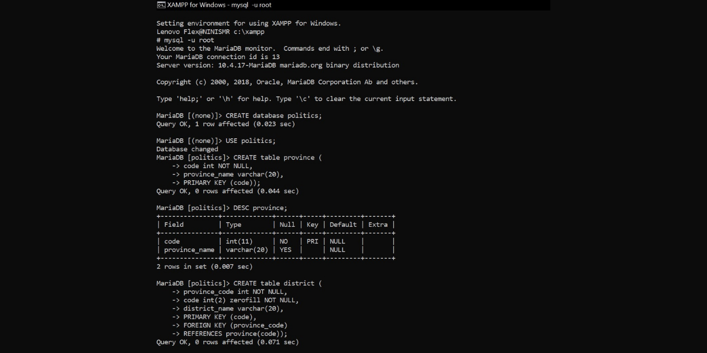

# Creating Politics Database using MariaDB
This is the final project of my Database System course. In this project, I created a database with a 'Politics' topic using MariaDB with several commands such as CREATE, DESC, INSERT, SELECT, FROM, UPDATE, DELETE, JOIN, LEFT JOIN, RIGHT JOIN, aggregate functions (MIN, MAX, COUNT, SUM, and AVG), GROUP BY, conditions (WHERE), subquery (nested query), sub-subquery, UNION, INTERSECT, ALTER TABLE, MODIFY, CHANGE, etc.

For more detail about all of the queries or commands that I used, you may download and read the report that I have already attached.

